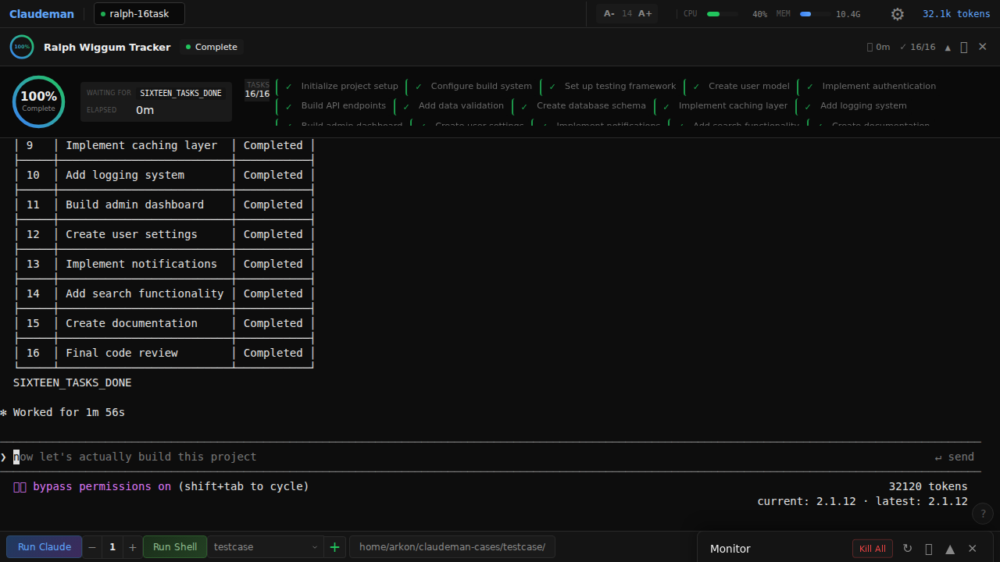

<h1 align="center">
  <br>
  🤖 Claudeman
  <br>
</h1>

<h3 align="center">Track Claude Code Sessions Better Than Ever</h3>

<p align="center">
  <em>Run 20 agents in parallel. Track them in real-time. The Respawn Controller keeps them working while you sleep.</em>
</p>

<p align="center">
  <a href="https://opensource.org/licenses/MIT"></a>
  <a href="https://nodejs.org/"></a>
  <a href="https://www.typescriptlang.org/"></a>
  <a href="https://fastify.dev/"></a>
  
</p>

<p align="center">
  <a href="#-the-problem">Problem</a> •
  <a href="#-the-solution">Solution</a> •
  <a href="#-quick-start">Quick Start</a> •
  <a href="#-features">Features</a> •
  <a href="#-ralph-wiggum-loops">Ralph Loops</a> •
  <a href="#-api">API</a>
</p>

---

<p align="center">
  
</p>

---

## 🚨 The Problem

You're running Claude Code on a complex refactor. **Three hours in:**

| Issue | Impact |
|-------|--------|
| 💥 **Session crashes** | All your context is gone. Start over. |
| 🔄 **Token limit hit** | Forced to manually `/clear` — breaks your flow |
| 😴 **You went to sleep** | Claude finished at 2am, sat idle for 6 hours |
| 🤯 **5 parallel sessions** | Which one had the auth fix? Where's the API changes? |
| 💸 **Surprise costs** | No visibility into token usage until the bill arrives |

**Claude Code is incredibly powerful.**
**Now you can track and manage it like never before.**

---

## ✨ The Solution

```bash
git clone https://github.com/Ark0N/claudeman.git && cd claudeman
npm install && npm run build
claudeman web
```

**Open http://localhost:3000** and you get:

<table>
<tr>
<td width="50%">

### 🖥️ Multi-Session Dashboard
- **20 parallel sessions** with real-time terminals
- Tab-based navigation with keyboard shortcuts
- Per-session token tracking and cost monitoring
- One-click bulk operations

</td>
<td width="50%">

### 💾 Crash-Proof Persistence
- Every session runs in **GNU Screen**
- Survives server restarts, network drops, machine sleep
- Auto-discovery of orphaned sessions on startup
- Never lose work again

</td>
</tr>
<tr>
<td width="50%">

### 🔄 Respawn Controller
- **The key to autonomous work while you sleep**
- Detects when Claude becomes idle and restarts work
- Auto-cycles `/clear` → `/init` to continue fresh
- Keeps going even if Ralph Wiggum loops stop
- Run for **24+ hours** completely unattended

</td>
<td width="50%">

### 🎯 Ralph Loop Tracking
- Detects `<promise>COMPLETE</promise>` patterns
- Tracks TodoWrite progress (`- [x]`, `- [ ]`)
- Shows iteration count (`[5/50]`)
- Real-time progress visualization

</td>
</tr>
</table>

---

## 🚀 Quick Start

### Prerequisites

| Requirement | Why |
|-------------|-----|
| **Node.js 18+** | ES2022 module syntax |
| **Claude CLI** | `claude` command in PATH ([Install](https://claude.ai/code)) |
| **GNU Screen** | Session persistence (`apt install screen` / `brew install screen`) |

### Installation

```bash
# Clone and install
git clone https://github.com/Ark0N/claudeman.git
cd claudeman
npm install
npm run build

# Make 'claudeman' available globally (optional)
npm link
```

### Launch

```bash
# Production
claudeman web

# Development (no build required)
npx tsx src/index.ts web

# Custom port
claudeman web -p 8080
```

### Your First Session

1. Open **http://localhost:3000**
2. Press **`Ctrl+Enter`** or click **"Run Claude"**
3. Your session is now:
   - ✅ Running in GNU Screen (persistent)
   - ✅ Tracking tokens and costs
   - ✅ Ready for Ralph Loop detection

---

## 🎮 Features

### Real-Time Terminal Streaming

<p align="center">
  
</p>

- **60fps rendering** — Server batches at 16ms, client uses `requestAnimationFrame`
- **Full xterm.js** — Colors, cursor, resize, selection, everything works
- **No polling** — Real-time SSE for instant updates

### Smart Token Management

```
┌─────────────────────────────────────────────────────────────┐
│                    TOKEN LIFECYCLE                          │
├─────────────────────────────────────────────────────────────┤
│  0k ─────────── 110k ─────────── 140k ─────────── 200k     │
│                   │                │                        │
│                   ▼                ▼                        │
│              Auto-Compact     Auto-Clear                    │
│              (/compact)       (/clear)                      │
│                   │                │                        │
│                   └── Summarize ───┴── Reset & Continue ─► │
└─────────────────────────────────────────────────────────────┘
```

| Threshold | Action | What Happens |
|-----------|--------|--------------|
| **110k tokens** | Auto `/compact` | Context is summarized, work continues |
| **140k tokens** | Auto `/clear` | Full reset with `/init`, fresh start |

**Configure per-session:**
```bash
curl -X POST localhost:3000/api/sessions/:id/auto-compact \
  -d '{"enabled": true, "threshold": 100000}'
```

### Session Persistence

Every Claude session runs inside GNU Screen with environment awareness:

```bash
# Inside every Claudeman session:
CLAUDEMAN_SCREEN=1
CLAUDEMAN_SESSION_ID=abc-123-def
CLAUDEMAN_SCREEN_NAME=claudeman-myproject
```

**Why this matters:**
- Claude knows it's in a managed session
- Won't accidentally kill its own screen
- The default CLAUDE.md template includes safety instructions

### Resource Monitoring

The dashboard shows real-time resource usage:

| Metric | Location | Warning Threshold |
|--------|----------|-------------------|
| Memory per session | Monitor panel | Yellow at 500MB, Red at 1GB |
| Total screen count | Status bar | Shown with uptime |
| Token usage | Per-session | Color-coded by threshold |
| Cost tracking | Per-session | Running USD total |

---

## 🔁 Ralph Wiggum Loops

The **Ralph Loop** is Claudeman's killer feature: **run Claude autonomously for 24+ hours**.

<p align="center">
  
</p>

### How It Works

```
┌──────────────────────────────────────────────────────────────┐
│                    RALPH LOOP CYCLE                          │
├──────────────────────────────────────────────────────────────┤
│                                                              │
│  ┌─────────┐    ┌──────────┐    ┌─────────┐    ┌─────────┐ │
│  │  WATCH  │───►│  DETECT  │───►│ RESPAWN │───►│ CONTINUE│ │
│  │  (idle) │    │ complete │    │  cycle  │    │  work   │ │
│  └─────────┘    └──────────┘    └─────────┘    └────┬────┘ │
│       ▲                                              │      │
│       └──────────────────────────────────────────────┘      │
│                                                              │
└──────────────────────────────────────────────────────────────┘
```

### Detection Patterns

Claudeman automatically detects Ralph loops when it sees:

| Pattern | Example | Auto-Enables |
|---------|---------|--------------|
| Promise tags | `<promise>COMPLETE</promise>` | ✅ |
| Custom phrases | `<promise>AUTH_REFACTOR_DONE</promise>` | ✅ |
| TodoWrite | `- [ ] Task`, `- [x] Done` | ✅ |
| Iterations | `[5/50]`, `Iteration 5 of 50` | ✅ |
| Skill command | `/ralph-loop:ralph-loop` | ✅ |

### Running a Ralph Loop

**Via CLI:**
```bash
# Queue tasks
claudeman task add "Review all files in src/ for security issues"
claudeman task add "Add comprehensive test coverage"
claudeman task add "Update all documentation"

# Start loop (minimum 8 hours)
claudeman ralph start --min-hours 8

# Check status
claudeman ralph status
```

**Via API:**
```bash
# Enable respawn with timer
curl -X POST localhost:3000/api/sessions/:id/respawn/enable \
  -H "Content-Type: application/json" \
  -d '{
    "config": {
      "updatePrompt": "continue improving the codebase",
      "idleTimeoutMs": 5000
    },
    "durationMinutes": 480
  }'
```

### Time-Aware Loops

When you specify a minimum duration, Claudeman:

1. Completes all primary tasks
2. Checks elapsed time
3. **If minimum not reached:** Generates follow-up tasks
   - Code optimization
   - Test coverage improvements
   - Security hardening
   - Documentation gaps
4. Only outputs completion phrase when time is met

---

## ⌨️ Keyboard Shortcuts

| Shortcut | Action |
|----------|--------|
| `Ctrl+Enter` | Quick-start: Create case + start session |
| `Ctrl+W` | Close current session |
| `Ctrl+Tab` | Switch to next session |
| `Ctrl+Shift+Tab` | Switch to previous session |
| `Ctrl+K` | Kill all sessions |
| `Ctrl+L` | Clear terminal |
| `Ctrl++` / `Ctrl+-` | Increase/decrease font size |
| `Ctrl+?` | Show help overlay |
| `Escape` | Close panels and modals |

---

## 📡 API Reference

### Session Management

| Method | Endpoint | Description |
|--------|----------|-------------|
| `GET` | `/api/sessions` | List all sessions |
| `POST` | `/api/sessions` | Create new session |
| `GET` | `/api/sessions/:id` | Get session details |
| `DELETE` | `/api/sessions/:id` | Delete session |
| `POST` | `/api/sessions/:id/input` | Send terminal input |
| `POST` | `/api/sessions/:id/resize` | Resize terminal |
| `POST` | `/api/sessions/:id/interactive` | Start interactive mode |

### Respawn Control

| Method | Endpoint | Description |
|--------|----------|-------------|
| `POST` | `/api/sessions/:id/respawn/start` | Start respawn controller |
| `POST` | `/api/sessions/:id/respawn/stop` | Stop respawn controller |
| `POST` | `/api/sessions/:id/respawn/enable` | Enable with config + timer |
| `PUT` | `/api/sessions/:id/respawn/config` | Update running config |

### Token Management

| Method | Endpoint | Description |
|--------|----------|-------------|
| `POST` | `/api/sessions/:id/auto-compact` | Configure auto-compact |
| `POST` | `/api/sessions/:id/auto-clear` | Configure auto-clear |

### Ralph Loop Tracking

| Method | Endpoint | Description |
|--------|----------|-------------|
| `GET` | `/api/sessions/:id/inner-state` | Get loop state + todos |
| `POST` | `/api/sessions/:id/inner-config` | Configure tracking |

### Real-Time Events

| Method | Endpoint | Description |
|--------|----------|-------------|
| `GET` | `/api/events` | SSE stream for all updates |
| `GET` | `/api/status` | Full application state |
| `GET` | `/api/screens` | Screen session list |

### Quick Start

| Method | Endpoint | Description |
|--------|----------|-------------|
| `POST` | `/api/quick-start` | Create case + start session |
| `GET` | `/api/cases` | List available cases |
| `POST` | `/api/cases` | Create new case |

---

## 🏗️ Architecture

```
┌─────────────────────────────────────────────────────────────────┐
│                         CLAUDEMAN                               │
├─────────────────────────────────────────────────────────────────┤
│                                                                 │
│  ┌──────────────┐  ┌──────────────┐  ┌──────────────────────┐  │
│  │   Web UI     │  │   REST API   │  │   SSE Events         │  │
│  │  (xterm.js)  │◄─┤   (Fastify)  │──┤  (/api/events)       │  │
│  └──────────────┘  └──────┬───────┘  └──────────────────────┘  │
│                           │                                     │
│  ┌────────────────────────┴─────────────────────────────────┐  │
│  │                    Session Manager                        │  │
│  │  ┌─────────┐ ┌─────────┐ ┌─────────┐ ┌─────────────────┐ │  │
│  │  │Session 1│ │Session 2│ │Session N│ │ RespawnController│ │  │
│  │  │  (PTY)  │ │  (PTY)  │ │  (PTY)  │ │  (per-session)   │ │  │
│  │  └────┬────┘ └────┬────┘ └────┬────┘ └─────────────────┘ │  │
│  └───────┼───────────┼───────────┼──────────────────────────┘  │
│          │           │           │                              │
│  ┌───────┴───────────┴───────────┴──────────────────────────┐  │
│  │                   GNU Screen Manager                      │  │
│  │     claudeman-abc    claudeman-def    claudeman-xyz       │  │
│  └───────────────────────────────────────────────────────────┘  │
│                              │                                  │
│  ┌───────────────────────────┴──────────────────────────────┐  │
│  │                     Claude CLI                            │  │
│  │            claude --dangerously-skip-permissions          │  │
│  └───────────────────────────────────────────────────────────┘  │
│                                                                 │
└─────────────────────────────────────────────────────────────────┘
```

### Key Components

| Component | File | Purpose |
|-----------|------|---------|
| **Session** | `src/session.ts` | PTY wrapper for Claude CLI |
| **RespawnController** | `src/respawn-controller.ts` | Autonomous cycling state machine |
| **ScreenManager** | `src/screen-manager.ts` | GNU Screen lifecycle management |
| **InnerLoopTracker** | `src/inner-loop-tracker.ts` | Ralph loop detection |
| **TaskTracker** | `src/task-tracker.ts` | Background task parsing |
| **WebServer** | `src/web/server.ts` | Fastify REST + SSE |
| **StateStore** | `src/state-store.ts` | JSON persistence |

---

## 🧪 Development

```bash
# Install dependencies
npm install

# Run in development mode (no build needed)
npx tsx src/index.ts web

# Type checking
npm run typecheck

# Run tests
npm test                          # All tests
npm run test:watch               # Watch mode
npx vitest run test/session.test.ts  # Single file

# Build for production
npm run build
```

### Test Structure

```
test/
├── unit/
│   ├── respawn-controller.test.ts
│   ├── inner-loop-tracker.test.ts
│   ├── ralph-loop.test.ts
│   ├── session-manager.test.ts
│   └── ...
└── integration/
    ├── session.test.ts
    ├── quick-start.test.ts
    └── ...
```

---

## 📊 Performance

Built for **24+ hour autonomous runs** with multiple sessions:

| Optimization | Implementation |
|--------------|----------------|
| **60fps streaming** | 16ms server batching, `requestAnimationFrame` client |
| **Memory management** | Auto-trimming buffers (5MB → 4MB on overflow) |
| **Event debouncing** | 50-500ms debounce on rapid state changes |
| **CSS containment** | Isolated paint operations per component |
| **Incremental DOM** | Only changed elements re-render |

### Buffer Limits

| Buffer | Max Size | Trim To |
|--------|----------|---------|
| Terminal | 5MB | 4MB |
| Text output | 2MB | 1.5MB |
| Messages | 1000 | 800 |
| Respawn | 1MB | 512KB |

---

## ❓ FAQ

**Q: How long can sessions run?**
A: 24+ hours. Automatic buffer management keeps memory stable.

**Q: Does it work with Claude Code hooks?**
A: Yes! Claudeman spawns real Claude CLI processes with full hook support.

**Q: What if the server restarts?**
A: Screen sessions persist. Claudeman auto-discovers them on startup.

**Q: Can I use custom completion phrases?**
A: Yes! Use `<promise>YOUR_PHRASE</promise>` in your prompts.

**Q: Maximum parallel sessions?**
A: 20 in the UI, 50 via API.

**Q: Does it work on macOS/Linux/Windows?**
A: macOS and Linux fully supported. Windows requires WSL2.

---

## 🤝 Contributing

1. Fork the repository
2. Create feature branch (`git checkout -b feature/amazing`)
3. Write tests for new functionality
4. Ensure tests pass (`npm test`)
5. Commit with conventional commits (`feat:`, `fix:`, `docs:`)
6. Open Pull Request

See [CLAUDE.md](./CLAUDE.md) for detailed development documentation.

---

## 📄 License

MIT License — see [LICENSE](LICENSE) for details.

---

<p align="center">
  <strong>Track sessions. Control respawn. Ship while you sleep.</strong>
  <br>
  <sub>Built for developers running serious autonomous Claude Code sessions.</sub>
</p>
