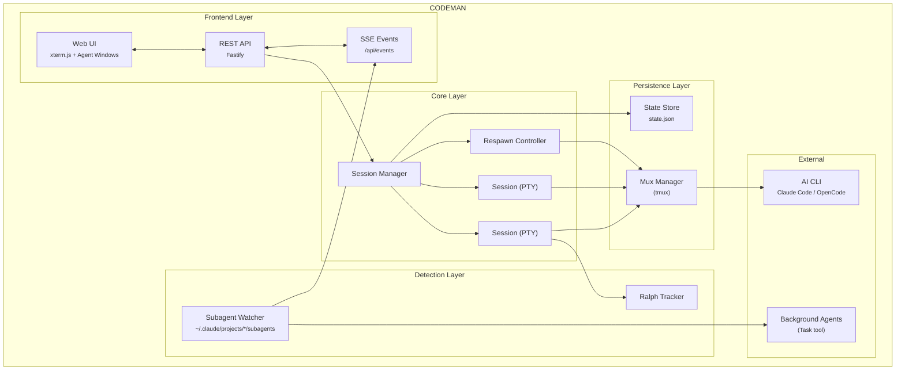

<p align="center">
  
</p>

<h2 align="center">The missing control plane for AI coding agents</h2>

<p align="center">
  <em>Agent Visualization &bull; Zero-Lag Input Overlay &bull; Mobile-First UI &bull; Respawn Controller &bull; Multi-Session Dashboard </em>
</p>

<p align="center">
  <a href="https://opensource.org/licenses/MIT"></a>
  <a href="https://nodejs.org/"></a>
  <a href="https://www.typescriptlang.org/"></a>
  <a href="https://fastify.dev/"></a>
  
</p>

<p align="center">
  
</p>

---

## Quick Start - Installation

```bash
curl -fsSL https://raw.githubusercontent.com/Ark0N/Codeman/master/install.sh | bash
```

This installs Node.js and tmux if missing, clones Codeman to `~/.codeman/app`, and builds it. You'll need at least one AI coding CLI installed — [Claude Code](https://docs.anthropic.com/en/docs/claude-code) or [OpenCode](https://opencode.ai) (or both). After install:

```bash
codeman web
# Open http://localhost:3000 — press Ctrl+Enter to start your first session
```

**Update to latest version:**
```bash
curl -fsSL https://raw.githubusercontent.com/Ark0N/Codeman/master/install.sh | bash -s update
```

<details>
<summary><strong>Run as a background service</strong></summary>

**Linux (systemd):**
```bash
mkdir -p ~/.config/systemd/user && printf '[Unit]\nDescription=Codeman Web Server\nAfter=network.target\n\n[Service]\nType=simple\nExecStart=%s %s/dist/index.js web\nRestart=always\nRestartSec=10\n\n[Install]\nWantedBy=default.target\n' "$(which node)" "$HOME/.codeman/app" > ~/.config/systemd/user/codeman-web.service && systemctl --user daemon-reload && systemctl --user enable --now codeman-web && loginctl enable-linger $USER
```

**macOS (launchd):**
```bash
mkdir -p ~/Library/LaunchAgents && printf '<?xml version="1.0" encoding="UTF-8"?>\n<!DOCTYPE plist PUBLIC "-//Apple//DTD PLIST 1.0//EN" "http://www.apple.com/DTDs/PropertyList-1.0.dtd">\n<plist version="1.0"><dict><key>Label</key><string>com.codeman.web</string><key>ProgramArguments</key><array><string>%s</string><string>%s/dist/index.js</string><string>web</string></array><key>RunAtLoad</key><true/><key>KeepAlive</key><true/><key>StandardOutPath</key><string>/tmp/codeman.log</string><key>StandardErrorPath</key><string>/tmp/codeman.log</string></dict></plist>\n' "$(which node)" "$HOME/.codeman/app" > ~/Library/LaunchAgents/com.codeman.web.plist && launchctl load ~/Library/LaunchAgents/com.codeman.web.plist
```
</details>

<details>
<summary><strong>Windows (WSL)</strong></summary>

```powershell
wsl bash -c "curl -fsSL https://raw.githubusercontent.com/Ark0N/Codeman/master/install.sh | bash"
```

Codeman requires tmux, so Windows users need [WSL](https://learn.microsoft.com/en-us/windows/wsl/install). If you don't have WSL yet: run `wsl --install` in an admin PowerShell, reboot, open Ubuntu, then install your preferred AI coding CLI inside WSL ([Claude Code](https://docs.anthropic.com/en/docs/claude-code) or [OpenCode](https://opencode.ai)). After installing, `http://localhost:3000` is accessible from your Windows browser.
</details>

---

## Mobile-Optimized Web UI

The most responsive AI coding agent experience on any phone. Full xterm.js terminal with local echo, swipe navigation, and a touch-optimized interface designed for real remote work.

<table>
<tr>
<td rowspan="8" width="320"></td>
<th>Terminal Apps</th>
<th>Codeman Mobile</th>
</tr>
<tr><td>200-300ms input lag over remote</td><td><b>Local echo — instant feedback</b></td></tr>
<tr><td>Tiny text, no context</td><td>Full xterm.js terminal</td></tr>
<tr><td>No session management</td><td>Swipe between sessions</td></tr>
<tr><td>No notifications</td><td>Push alerts for approvals and idle</td></tr>
<tr><td>Manual reconnect</td><td>tmux persistence</td></tr>
<tr><td>No agent visibility</td><td>Background agents in real-time</td></tr>
<tr><td>Copy-paste slash commands</td><td>One-tap <code>/init</code></tr>
</table>

- **Swipe navigation** — left/right on the terminal to switch sessions (80px threshold, 300ms)
- **Keyboard accessory bar** — `/init`, `/clear`, `/compact` quick-action buttons above the virtual keyboard. Destructive commands (`/clear`, `/compact`) require a double-press to confirm — first tap arms the button, second tap executes — so you never fire one by accident on a bumpy commute
- **Smart keyboard handling** — toolbar and terminal shift up when keyboard opens (uses `visualViewport` API with 100px threshold for iOS address bar drift)
- **Safe area support** — respects iPhone notch and home indicator via `env(safe-area-inset-*)`
- **44px touch targets** — all buttons meet iOS Human Interface Guidelines minimum sizes
- **Bottom sheet case picker** — slide-up modal replaces the desktop dropdown
- **Native momentum scrolling** — `-webkit-overflow-scrolling: touch` for buttery scroll

```bash
codeman web --https
# Open on your phone: https://<your-ip>:3000
```

> `localhost` works over plain HTTP. Use `--https` when accessing from another device, or use [Tailscale](https://tailscale.com/) (recommended) — it provides a private network so you can access `http://<tailscale-ip>:3000` from your phone without TLS certificates.

---

## Live Agent Visualization

Watch background agents work in real-time. Codeman monitors agent activity and displays each agent in a draggable floating window with animated Matrix-style connection lines back to the parent session.

<p align="center">
  
</p>

- **Floating terminal windows** — draggable, resizable panels for each agent with a live activity log showing every tool call, file read, and progress update as it happens
- **Connection lines** — animated green lines linking parent sessions to their child agents, updating in real-time as agents spawn and complete
- **Status & model badges** — green (active), yellow (idle), blue (completed) indicators with Haiku/Sonnet/Opus model color coding
- **Auto-behavior** — windows auto-open on spawn, auto-minimize on completion, tab badge shows "AGENT" or "AGENTS (n)" count
- **Nested agents** — supports 3-level hierarchies (lead session -> teammate agents -> sub-subagents)

---

## Zero-Lag Input Overlay

When accessing your coding agent remotely (VPN, Tailscale, SSH tunnel), every keystroke normally takes 200-300ms to round-trip. Codeman implements a **Mosh-inspired local echo system** that makes typing feel instant regardless of latency.

A pixel-perfect DOM overlay inside xterm.js renders keystrokes at 0ms. Background forwarding silently sends every character to the PTY in 50ms debounced batches, so Tab completion, `Ctrl+R` history search, and all shell features work normally. When the server echo arrives 200-300ms later, the overlay seamlessly disappears and the real terminal text takes over — the transition is invisible.

- **Ink-proof architecture** — lives as a `<span>` at z-index 7 inside `.xterm-screen`, completely immune to Ink's constant screen redraws (two previous attempts using `terminal.write()` failed because Ink corrupts injected buffer content)
- **Font-matched rendering** — reads `fontFamily`, `fontSize`, `fontWeight`, and `letterSpacing` from xterm.js computed styles so overlay text is visually indistinguishable from real terminal output
- **Full editing** — backspace, retype, paste (multi-char), cursor tracking, multi-line wrap when input exceeds terminal width
- **Persistent across reconnects** — unsent input survives page reloads via localStorage
- **Enabled by default** — works on both desktop and mobile, during idle and busy sessions

> Extracted as a standalone library: [`xterm-zerolag-input`](https://www.npmjs.com/package/xterm-zerolag-input) — see [Published Packages](#published-packages).

---

## Respawn Controller

The core of autonomous work. When the agent goes idle, the Respawn Controller detects it, sends a continue prompt, cycles context management commands for fresh context, and resumes — running **24+ hours** completely unattended.

```
WATCHING → IDLE DETECTED → SEND UPDATE → /clear → /init → CONTINUE → WATCHING
```

- **Multi-layer idle detection** — completion messages, AI-powered idle check, output silence, token stability
- **Circuit breaker** — prevents respawn thrashing when Claude is stuck (CLOSED -> HALF_OPEN -> OPEN states, tracks consecutive no-progress and repeated errors)
- **Health scoring** — 0-100 health score with component scores for cycle success, circuit breaker state, iteration progress, and stuck recovery
- **Built-in presets** — `solo-work` (3s idle, 60min), `subagent-workflow` (45s, 240min), `team-lead` (90s, 480min), `ralph-todo` (8s, 480min), `overnight-autonomous` (10s, 480min)

---

## Multi-Session Dashboard

Run **20 parallel sessions** with full visibility — real-time xterm.js terminals at 60fps, per-session token and cost tracking, tab-based navigation, and one-click management.

<p align="center">
  
</p>

### Persistent Sessions

Every session runs inside **tmux** — sessions survive server restarts, network drops, and machine sleep. Auto-recovery on startup with dual redundancy. Ghost session discovery finds orphaned tmux sessions. Managed sessions are environment-tagged so the agent won't kill its own session.

### Smart Token Management

| Threshold | Action | Result |
|-----------|--------|--------|
| **110k tokens** | Auto `/compact` | Context summarized, work continues |
| **140k tokens** | Auto `/clear` | Fresh start with `/init` |

### Notifications

Real-time desktop alerts when sessions need attention — `permission_prompt` and `elicitation_dialog` trigger critical red tab blinks, `idle_prompt` triggers yellow blinks. Click any notification to jump directly to the affected session. Hooks auto-configured per case directory.

### Ralph / Todo Tracking

Auto-detects Ralph Loops, `<promise>` tags, TodoWrite progress (`4/9 complete`), and iteration counters (`[5/50]`) with real-time progress rings and elapsed time tracking.

<p align="center">
  
</p>

### Run Summary

Click the chart icon on any session tab to see a timeline of everything that happened — respawn cycles, token milestones, auto-compact triggers, idle/working transitions, hook events, errors, and more.

### Zero-Flicker Terminal

Terminal-based AI agents (Claude Code's Ink, OpenCode's Bubble Tea) redraw the screen on every state change. Codeman implements a 6-layer anti-flicker pipeline for smooth 60fps output across all sessions:

```
PTY Output → 16ms Server Batch → DEC 2026 Wrap → SSE → Client rAF → xterm.js (60fps)
```

---

## Remote Access — Cloudflare Tunnel

Access Codeman from your phone or any device outside your local network using a free [Cloudflare quick tunnel](https://developers.cloudflare.com/cloudflare-one/connections/connect-networks/do-more-with-tunnels/trycloudflare/) — no port forwarding, no DNS, no static IP required.

```
Browser (phone/tablet) → Cloudflare Edge (HTTPS) → cloudflared → localhost:3000
```

**Prerequisites:** Install [`cloudflared`](https://developers.cloudflare.com/cloudflare-one/connections/connect-networks/downloads/) and set `CODEMAN_PASSWORD` in your environment.

```bash
# Quick start
./scripts/tunnel.sh start      # Start tunnel, prints public URL
./scripts/tunnel.sh url        # Show current URL
./scripts/tunnel.sh stop       # Stop tunnel
./scripts/tunnel.sh status     # Service status + URL
```

The script auto-installs a systemd user service on first run. The tunnel URL is a randomly generated `*.trycloudflare.com` address that changes each time the tunnel restarts.

<details>
<summary><strong>Persistent tunnel (survives reboots)</strong></summary>

```bash
# Enable as a persistent service
systemctl --user enable codeman-tunnel
loginctl enable-linger $USER

# Or via the Codeman web UI: Settings → Tunnel → Toggle On
```

</details>

<details>
<summary><strong>Authentication</strong></summary>

1. First request → browser shows Basic Auth prompt (username: `admin` or `CODEMAN_USERNAME`)
2. On success → server issues a `codeman_session` cookie (24h TTL, auto-extends on activity)
3. Subsequent requests authenticate silently via cookie
4. 10 failed attempts per IP → 429 rate limit (15-minute decay)

**Always set `CODEMAN_PASSWORD`** before exposing via tunnel — without it, anyone with the URL has full access to your sessions.

</details>

### QR Code Authentication

Typing a password on a phone keyboard is terrible. Codeman solves this with **ephemeral single-use QR tokens** — scan the code on your desktop, and your phone is instantly authenticated. No password prompt, no typing, no clipboard.

```
Desktop displays QR  →  Phone scans  →  GET /q/Xk9mQ3  →  Server validates
→  Token atomically consumed (single-use)  →  Session cookie issued  →  302 to /
→  Desktop notified: "Device authenticated via QR"  →  New QR auto-generated
```

Someone who only has the bare tunnel URL (without the QR) still hits the standard password prompt. The QR is the fast path; the password is the fallback.

#### How It Works

The server maintains a rotating pool of short-lived, single-use tokens. Each token consists of a 256-bit secret (`crypto.randomBytes(32)`) paired with a 6-character base62 short code used as an opaque lookup key in the URL path. The QR code encodes a URL like `https://abc-xyz.trycloudflare.com/q/Xk9mQ3` — the short code is a pointer, not the secret itself, so it never leaks through browser history, `Referer` headers, or Cloudflare edge logs.

Every **60 seconds**, the server automatically rotates to a fresh token. The previous token remains valid for a **90-second grace period** to handle the race where you scan right as rotation happens — after that, it's dead. Each token is **single-use**: the moment a phone successfully scans it, the token is atomically consumed and a new one is immediately generated for the desktop display.

#### Security Design

The design is informed by ["Demystifying the (In)Security of QR Code-based Login"](https://www.usenix.org/conference/usenixsecurity25/presentation/zhang-xin) (USENIX Security 2025), which found 47 of the top-100 websites vulnerable to QR auth attacks due to 6 critical design flaws across 42 CVEs. Codeman addresses all six:

| USENIX Flaw | Mitigation |
|-------------|------------|
| **Flaw-1**: Missing single-use enforcement | Token atomically consumed on first scan — replays always fail |
| **Flaw-2**: Long-lived tokens | 60s TTL with 90s grace, auto-rotation via timer |
| **Flaw-3**: Predictable token generation | `crypto.randomBytes(32)` — 256-bit entropy. Short codes use rejection sampling to eliminate modulo bias |
| **Flaw-4**: Client-side token generation | Server-side only — tokens never leave the server until embedded in the QR |
| **Flaw-5**: Missing status notification | Desktop toast: *"Device [IP] authenticated via QR (Safari). Not you? [Revoke]"* — real-time QRLjacking detection |
| **Flaw-6**: Inadequate session binding | IP + User-Agent stored for audit. Manual session revocation via API. HttpOnly + Secure + SameSite=lax cookies |

#### Timing-Safe Lookup

Short codes are stored in a `Map<shortCode, TokenRecord>`. Validation uses `Map.get()` — a hash-based O(1) lookup that reveals nothing about the target string through response timing. There is no character-by-character string comparison anywhere in the hot path, eliminating timing side-channel attacks entirely.

#### Rate Limiting (Dual Layer)

QR auth has its own rate limiting, completely independent from password auth:

- **Per-IP**: 10 failed QR attempts per IP trigger a 429 block (15-minute decay window) — separate counter from Basic Auth failures, so a fat-fingered password doesn't burn your QR budget
- **Global**: 30 QR attempts per minute across all IPs combined — defends against distributed brute force. With 62^6 = 56.8 billion possible short codes and only ~2 valid at any time, brute force is computationally infeasible regardless

#### QR Code Size Optimization

The URL is kept deliberately short (`/q/` path + 6-char code = ~53-56 total characters) to target **QR Version 4** (33x33 modules) instead of Version 5 (37x37). Smaller QR codes scan faster on budget phones — modern devices read Version 4 in 100-300ms. The `/q/` prefix saves 7 bytes compared to `/qr-auth/`, which alone is the difference between QR versions.

#### Desktop Experience

The QR display auto-refreshes every 60 seconds via SSE with the SVG embedded directly in the event payload (~2-5KB) — no extra HTTP fetch, sub-50ms refresh. A countdown timer shows time remaining. A "Regenerate" button instantly invalidates all existing tokens and creates a fresh one (useful if you suspect the QR was photographed).

When someone authenticates via QR, the desktop shows a notification toast with the device's IP and browser — if it wasn't you, one click revokes all sessions.

#### Threat Coverage

| Threat | Why it doesn't work |
|--------|-------------------|
| **QR screenshot shared** | Single-use: consumed on first scan. 60s TTL: expired before the attacker can act. Desktop notification alerts you immediately. |
| **Replay attack** | Atomic single-use consumption + 60s TTL. Old URLs always return 401. |
| **Cloudflare edge logs** | Short code is an opaque 6-char lookup key, not the real 256-bit token. Single-use means replaying from logs always fails. |
| **Brute force** | 56.8 billion combinations, ~2 valid at any time, dual-layer rate limiting blocks well before statistical feasibility. |
| **QRLjacking** | 60s rotation forces real-time relay. Desktop toast provides instant detection. Self-hosted single-user context makes phishing implausible. |
| **Timing attack** | Hash-based Map lookup — no string comparison timing leak. |
| **Session cookie theft** | HttpOnly + Secure + SameSite=lax + 24h TTL. Manual revocation at `POST /api/auth/revoke`. |

#### How It Compares

| Platform | Model | Comparison |
|----------|-------|------------|
| **Discord** | Long-lived token, no confirmation, [repeatedly exploited](https://owasp.org/www-community/attacks/Qrljacking) | Codeman: single-use + TTL + notification |
| **WhatsApp Web** | Phone confirms "Link device?", ~60s rotation | Comparable rotation; WhatsApp adds explicit confirmation (acceptable tradeoff for single-user) |
| **Signal** | Ephemeral public key, E2E encrypted channel | Stronger crypto, but [exploited by Russian state actors in 2025](https://cloud.google.com/blog/topics/threat-intelligence/russia-targeting-signal-messenger) via social engineering despite it |

> Full design rationale, security analysis, and implementation details: [`docs/qr-auth-plan.md`](docs/qr-auth-plan.md)

---

## SSH Alternative (`sc`)

If you prefer SSH (Termius, Blink, etc.), the `sc` command is a thumb-friendly session chooser:

```bash
sc              # Interactive chooser
sc 2            # Quick attach to session 2
sc -l           # List sessions
```

Single-digit selection (1-9), color-coded status, token counts, auto-refresh. Detach with `Ctrl+A D`.

---

## Keyboard Shortcuts

| Shortcut | Action |
|----------|--------|
| `Ctrl+Enter` | Quick-start session |
| `Ctrl+W` | Close session |
| `Ctrl+Tab` | Next session |
| `Ctrl+K` | Kill all sessions |
| `Ctrl+L` | Clear terminal |
| `Ctrl+Shift+R` | Restore terminal size |
| `Ctrl/Cmd +/-` | Font size |
| `Escape` | Close panels |

---

## API

### Sessions
| Method | Endpoint | Description |
|--------|----------|-------------|
| `GET` | `/api/sessions` | List all |
| `POST` | `/api/quick-start` | Create case + start session |
| `DELETE` | `/api/sessions/:id` | Delete session |
| `POST` | `/api/sessions/:id/input` | Send input |

### Respawn
| Method | Endpoint | Description |
|--------|----------|-------------|
| `POST` | `/api/sessions/:id/respawn/enable` | Enable with config + timer |
| `POST` | `/api/sessions/:id/respawn/stop` | Stop controller |
| `PUT` | `/api/sessions/:id/respawn/config` | Update config |

### Ralph / Todo
| Method | Endpoint | Description |
|--------|----------|-------------|
| `GET` | `/api/sessions/:id/ralph-state` | Get loop state + todos |
| `POST` | `/api/sessions/:id/ralph-config` | Configure tracking |

### Subagents
| Method | Endpoint | Description |
|--------|----------|-------------|
| `GET` | `/api/subagents` | List all background agents |
| `GET` | `/api/subagents/:id` | Agent info and status |
| `GET` | `/api/subagents/:id/transcript` | Full activity transcript |
| `DELETE` | `/api/subagents/:id` | Kill agent process |

### System
| Method | Endpoint | Description |
|--------|----------|-------------|
| `GET` | `/api/events` | SSE stream |
| `GET` | `/api/status` | Full app state |
| `POST` | `/api/hook-event` | Hook callbacks |
| `GET` | `/api/sessions/:id/run-summary` | Timeline + stats |

---

## Architecture



---

## Development

```bash
npm install
npx tsx src/index.ts web    # Dev mode
npm run build               # Production build
npm test                    # Run tests
```

See [CLAUDE.md](./CLAUDE.md) for full documentation.

---

## Codebase Quality

The codebase went through a comprehensive 7-phase refactoring that eliminated god objects, centralized configuration, and established modular architecture:

| Phase | What changed | Impact |
|-------|-------------|--------|
| **Performance** | Cached endpoints, SSE adaptive batching, buffer chunking | Sub-16ms terminal latency |
| **Route extraction** | `server.ts` split into 12 domain route modules + auth middleware + port interfaces | **−60%** server.ts LOC (6,736 → 2,697) |
| **Domain splitting** | `types.ts` → 14 domain files, `ralph-tracker` → 7 files, `respawn-controller` → 5 files, `session` → 6 files | No more god files |
| **Frontend modules** | `app.js` → 8 extracted modules (constants, mobile, voice, notifications, keyboard, API, subagent windows) | **−24%** app.js LOC (15.2K → 11.5K) |
| **Config consolidation** | ~70 scattered magic numbers → 9 domain-focused config files | Zero cross-file duplicates |
| **Test infrastructure** | Shared mock library, 12 route test files, consolidated MockSession | Testable route handlers via `app.inject()` |

Full details: [`docs/code-structure-findings.md`](docs/code-structure-findings.md)

---

## Published Packages

### [`xterm-zerolag-input`](https://www.npmjs.com/package/xterm-zerolag-input)

[](https://www.npmjs.com/package/xterm-zerolag-input)

Instant keystroke feedback overlay for xterm.js. Eliminates perceived input latency over high-RTT connections by rendering typed characters immediately as a pixel-perfect DOM overlay. Zero dependencies, configurable prompt detection, full state machine with 78 tests.

```bash
npm install xterm-zerolag-input
```

[Full documentation](packages/xterm-zerolag-input/README.md)

---

## License

MIT — see [LICENSE](LICENSE)

---

<p align="center">
  <strong>Track sessions. Visualize agents. Control respawn. Let it run while you sleep.</strong>
</p>
