<p align="center">
  
</p>

<h2 align="center">Manage Claude Code sessions better than ever</h2>

<p align="center">
  Autonomous Claude Code work while you sleep<br>
  <em>Persistent sessions, Ralph Loop tracking, Respawn Controller, Agent Visualization, Multi-Session Dashboards</em>
</p>

<p align="center">
  <a href="https://opensource.org/licenses/MIT"></a>
  <a href="https://nodejs.org/"></a>
  <a href="https://www.typescriptlang.org/"></a>
  <a href="https://fastify.dev/"></a>
  
</p>

---

<p align="center">
  
</p>

---


<p align="center">
  
</p>

---

## What Claudeman Does

### 🔔 Notification System

Real-time desktop notifications when sessions need attention — never miss a permission prompt or idle session again:

| Hook Event | Urgency | Tab Alert | Meaning |
|------------|---------|-----------|---------|
| `permission_prompt` | Critical | Red blink | Claude needs tool approval |
| `elicitation_dialog` | Critical | Red blink | Claude is asking a question |
| `idle_prompt` | Warning | Yellow blink | Session idle, waiting for input |
| `stop` | Info | — | Response complete |

**Features:**
- Browser notifications enabled by default (auto-requests permission)
- Click any notification to jump directly to the affected session
- Tab blinking alerts: red for action-required, yellow for idle
- Notifications include actual context (tool name, command, question text)
- Hooks are auto-configured per case directory (`.claude/settings.local.json`)
- Works on HTTP for local use (localhost is a secure context)

---

### 💾 Persistent Sessions

Every Claude session runs inside **tmux** — sessions survive server restarts, network drops, and machine sleep.

```bash
# Your sessions are always recoverable
CLAUDEMAN_MUX=1
CLAUDEMAN_SESSION_ID=abc-123-def
CLAUDEMAN_MUX_NAME=claudeman-myproject
```

- Sessions auto-recover on startup (dual redundancy: `state.json` + `mux-sessions.json`)
- All settings (respawn, auto-compact, tokens) survive server restarts
- Ghost session discovery finds orphaned mux sessions
- Claude knows it's managed (won't kill its own session)

---

### 🔄 Respawn Controller

**The core of autonomous work.** When Claude becomes idle, the Respawn Controller kicks in:

| State | Action | Next |
|:-----:|:------:|:----:|
| **WATCHING** | Monitor for idle | IDLE DETECTED |
| **IDLE DETECTED** | Confirm silence | SEND UPDATE |
| **SEND UPDATE** | Push continue prompt | CLEAR |
| **CLEAR** | Run `/clear` | INIT |
| **INIT** | Run `/init` | CONTINUE |
| **CONTINUE** | Resume work | WATCHING |

- Multi-layer idle detection (completion messages, output silence, token stability)
- Sends configurable update prompts to continue work
- Auto-cycles `/clear` → `/init` for fresh context
- Step confirmation (5s silence) between each command
- **Keeps working even when Ralph loops stop**
- Run for **24+ hours** completely unattended

```bash
# Enable respawn with 8-hour timer
curl -X POST localhost:3000/api/sessions/:id/respawn/enable \
  -H "Content-Type: application/json" \
  -d '{
    "config": {
      "updatePrompt": "continue improving the codebase",
      "idleTimeoutMs": 5000
    },
    "durationMinutes": 480
  }'
```

---

### 🎯 Ralph / Todo Tracking

Claudeman detects and tracks Ralph Loops and Todos inside Claude Code:

<p align="center">
  
</p>

**Auto-detects:**
| Pattern | Example |
|---------|---------|
| Promise tags | `<promise>COMPLETE</promise>` |
| Custom phrases | `<promise>ALL_TASKS_DONE</promise>` |
| TodoWrite | `- [ ] Task`, `- [x] Done` |
| Iterations | `[5/50]`, `Iteration 5 of 50` |

**Tracks in real-time:**
- Completion phrase detection
- Todo progress (`4/9 complete`)
- Progress percentage ring
- Elapsed time

---

### 👁️ Live Agent Visualization

**Watch your agents work in real-time.** Claudeman monitors Claude Code's background agents (the `Task` tool) and displays them in draggable floating windows with Matrix-style connection lines.

<p align="center">
  
</p>

<p align="center">
  
</p>

**Features:**
- **Floating windows** — Draggable, resizable panels for each agent
- **Connection lines** — Animated green lines linking parent sessions to agent windows
- **Live activity log** — See every tool call, progress update, and message in real-time
- **Status indicators** — Green (active), yellow (idle), blue (completed)
- **Model badges** — Shows Haiku/Sonnet/Opus with color coding
- **Auto-behavior** — Windows auto-open on spawn, auto-minimize on completion
- **Tab badge** — Shows "AGENT" or "AGENTS (n)" count on session tabs

**Subagent API:**
| Method | Endpoint | Description |
|--------|----------|-------------|
| `GET` | `/api/subagents` | List all background agents |
| `GET` | `/api/subagents/:id` | Agent info and status |
| `GET` | `/api/subagents/:id/transcript` | Full activity transcript |
| `DELETE` | `/api/subagents/:id` | Kill agent process |

---

### 🔍 Project Insights Panel

Real-time visibility into what Claude is reading and searching:

- **Active Bash tools** displayed as they run (file viewers, grep, find)
- **Clickable file paths** — Jump directly to files in Claude Code
- **Timeout indicators** — See how long tools have been running
- **Smart deduplication** — Overlapping file ranges collapsed

Toggle via App Settings → Display → "Show Project Insights Panel"

---

### 📊 Smart Token Management

Never hit token limits unexpectedly:

| Threshold | Action | Result |
|-----------|--------|--------|
| **110k tokens** | Auto `/compact` | Context summarized, work continues |
| **140k tokens** | Auto `/clear` | Fresh start with `/init` |

```bash
# Configure per-session
curl -X POST localhost:3000/api/sessions/:id/auto-compact \
  -d '{"enabled": true, "threshold": 100000}'
```

---

### 🖥️ Multi-Session Dashboard

Run **20 parallel sessions** with full visibility:

- Real-time xterm.js terminals (60fps streaming)
- Per-session token and cost tracking
- Tab-based navigation
- One-click session management

<p align="center">
  
</p>

**Monitor Panel** — Real-time session monitoring with memory, CPU, and process info:

<p align="center">
  
</p>

---

### ⚡ Zero-Flicker Terminal Rendering

**The problem:** Claude Code uses [Ink](https://github.com/vadimdemedes/ink) (React for terminals), which redraws the entire screen on every state change. Without special handling, you'd see constant flickering — unusable for monitoring multiple sessions.

**The solution:** Claudeman implements a 6-layer antiflicker system that delivers butter-smooth 60fps terminal output:

| PTY Output | **→** | 16ms Batch | **→** | DEC 2026 Wrap | **→** | SSE | **→** | rAF Batch | **→** | xterm.js | **→** | 60fps Canvas |
|:----------:|:-----:|:----------:|:-----:|:-------------:|:-----:|:---:|:-----:|:---------:|:-----:|:--------:|:-----:|:------------:|

#### How Each Layer Works

| Layer | Location | Technique | Purpose |
|-------|----------|-----------|---------|
| **1. Server Batching** | server.ts | 16ms collection window | Combines rapid PTY writes into single packets |
| **2. DEC Mode 2026** | server.ts | `\x1b[?2026h`...`\x1b[?2026l` | Marks atomic update boundaries (terminal standard) |
| **3. Client rAF** | app.js | `requestAnimationFrame` | Syncs writes to 60Hz display refresh |
| **4. Sync Block Parser** | app.js | DEC 2026 extraction | Parses atomic segments for xterm.js |
| **5. Flicker Filter** | app.js | Ink pattern detection | Buffers screen-clear sequences (optional) |
| **6. Chunked Loading** | app.js | 64KB/frame writes | Large buffers don't freeze UI |

#### Technical Implementation

**Server-side (16ms batching + DEC 2026):**
```typescript
// Accumulate PTY output per-session
const newBatch = existing + data;
terminalBatches.set(sessionId, newBatch);

// Flush every 16ms (60fps) or immediately if >1KB
if (!terminalBatchTimer) {
  terminalBatchTimer = setTimeout(() => {
    for (const [id, data] of terminalBatches) {
      // Wrap with synchronized output markers
      const syncData = '\x1b[?2026h' + data + '\x1b[?2026l';
      broadcast('session:terminal', { id, data: syncData });
    }
    terminalBatches.clear();
  }, 16);
}
```

**Client-side (rAF batching + sync block handling):**
```javascript
batchTerminalWrite(data) {
  pendingWrites += data;

  if (!writeFrameScheduled) {
    writeFrameScheduled = true;
    requestAnimationFrame(() => {
      // Wait up to 50ms for incomplete sync blocks
      if (hasStartMarker && !hasEndMarker) {
        setTimeout(flushPendingWrites, 50);
        return;
      }

      // Extract atomic segments, strip markers, write to xterm
      const segments = extractSyncSegments(pendingWrites);
      for (const segment of segments) {
        terminal.write(segment);
      }
    });
  }
}
```

**Optional flicker filter** detects Ink's screen-clear patterns (`ESC[2J`, `ESC[H ESC[J`) and buffers 50ms of subsequent output for extra smoothness on problematic terminals.

**Result:** Watch 20 Claude sessions simultaneously without any visual artifacts, even during heavy tool use.

---

### ⌨️ Lag-Free Terminal Input — Local Echo with Background Forwarding

**The problem:** When accessing Claude Code remotely (VPN, Tailscale, SSH tunnel), every keystroke takes 200-300ms to echo back from the server. You type blind, make mistakes you can't see, and the whole experience feels broken. Traditional terminal apps have no solution for this — you're stuck with the round-trip latency.

**The solution:** Claudeman implements a **Mosh-inspired local echo system** that makes typing feel instant, no matter how far away the server is. Keystrokes appear immediately in a pixel-perfect DOM overlay while simultaneously being forwarded to the PTY in the background.

#### Why This Is Hard (and Why Nobody Else Does It)

Claude Code uses [Ink](https://github.com/vadimdemedes/ink) (React for terminals), which **redraws the entire screen on every state change**. This makes the standard approach of writing directly to the terminal buffer impossible — Ink would immediately corrupt any injected characters on its next redraw cycle. Two separate attempts to use `terminal.write()` for local echo both failed for this reason.

#### How It Works

The system has three components working together:

| Component | What It Does |
|-----------|-------------|
| **DOM Overlay** | A `<span>` positioned inside xterm.js's `.xterm-screen` at z-index 7. Shows typed characters with pixel-perfect font matching. Completely invisible to Ink because it never touches the terminal buffer. |
| **Background Forwarding** | Every keystroke is also sent to the PTY in the background (50ms debounced batches). The server's terminal state stays in sync — Tab completion, history, and all shell features work normally. |
| **Enter Split** | When you press Enter, any remaining buffered keystrokes are flushed first, then Enter is sent separately after 120ms. This ensures the PTY has the complete text before submission. |

#### The Overlay: Why a DOM Element Beats Buffer Writes

```
xterm.js DOM structure:
├── .xterm-viewport (scrolling)
└── .xterm-screen (position: relative)
      ├── .xterm-rows (z-index: 0)     ← Ink owns this, redraws constantly
      ├── .xterm-selection (z-index: 1)
      ├── .xterm-helpers (z-index: 5)
      └── LOCAL ECHO OVERLAY (z-index: 7)  ← Our overlay, Ink can't touch it
```

The overlay scans the terminal buffer bottom-up to find Claude Code's `❯` prompt marker, then positions itself right after it. It handles multi-line wrapping when input exceeds the terminal width, renders a block cursor at the end, and uses an opaque background that cleanly covers the server's stale cursor position.

Font matching is critical: the overlay reads `fontFamily`, `fontSize`, `fontWeight`, and `letterSpacing` directly from xterm.js's `.xterm-rows` computed style, so the echo text is visually indistinguishable from real terminal text.

#### Background Forwarding: The Key Innovation

Previous local echo implementations (including our own earlier attempts) buffered input locally and only sent it on Enter. This broke Tab completion, shell history, and any interactive feature that depends on the PTY seeing keystrokes in real-time.

Background forwarding solves this: every character is queued into a 50ms debounce buffer and sent to the PTY silently. The server processes keystrokes normally — Tab completion works, `Ctrl+R` history search works, everything works. The overlay just provides instant visual feedback while the round-trip happens invisibly.

```
Keystroke Flow:
                                    ┌─── DOM overlay (instant, 0ms)
User types 'h' ─── onData('h') ───┤
                                    └─── Background buffer ──[50ms]──→ PTY
                                                                        │
Server echoes 'h' ←────────────────────────────────────────────────────┘
         │                                                    (200-300ms RTT)
         └──→ flushPendingWrites() ──→ overlay.clear()
              (server output replaces overlay — seamless transition)
```

#### Edge Cases Handled

| Scenario | Behavior |
|----------|----------|
| **Paste** (multi-char) | Appended to overlay + sent to PTY immediately (no debounce) |
| **Backspace** | Removes last overlay char + sends `\x7f` to PTY in background |
| **Misprediction** | Server output arrives → overlay clears → server redraws correctly |
| **Tab completion** | Background forwarding means PTY receives Tab keystroke normally |
| **Ctrl+C / escape** | Overlay clears, control char sent immediately |
| **Page reload** | Unsent input persisted to `localStorage`, restored on reconnect |
| **Ink screen redraw** | Overlay is a separate DOM layer — completely unaffected |
| **Tab switch** | Background buffer flushed to outgoing session before switching |

#### The Result

Typing over a 200-300ms connection feels identical to localhost. The overlay provides instant character feedback while background forwarding keeps the PTY perfectly synchronized. When the server's echo arrives (200-300ms later), the overlay seamlessly disappears and the real terminal text takes over — the transition is invisible.

Enabled by default. Works during both idle and busy sessions.

---

### 📈 Run Summary ("What Happened While You Were Away")

Click the chart icon on any session tab to see a complete timeline of what happened:

**Tracked Events:**
- Session start/stop and respawn cycles
- Idle/working transitions with durations
- Token milestones (every 50k tokens)
- Auto-compact and auto-clear triggers
- Ralph Loop completions
- AI check results (idle detection verdicts)
- Hook events (permissions, questions, stops)
- Errors, warnings, and stuck-state alerts

**Stats at a glance:**
- Total respawn cycles
- Peak token usage
- Active vs idle time
- Error/warning counts

---

## Installation

### macOS & Linux

```bash
curl -fsSL https://raw.githubusercontent.com/Ark0N/claudeman/master/install.sh | bash
```

### Windows (WSL)

```powershell
wsl bash -c "curl -fsSL https://raw.githubusercontent.com/Ark0N/claudeman/master/install.sh | bash"
```

> **Prerequisites:** Claudeman requires tmux, so Windows users need [WSL](https://learn.microsoft.com/en-us/windows/wsl/install). If you don't have WSL yet:
> 1. Run `wsl --install` in an admin PowerShell, then reboot
> 2. Open **Ubuntu** from the Start menu to complete setup (create your Linux user)
> 3. Install Claude CLI inside WSL: `curl -fsSL https://claude.ai/install.sh | bash`
> 4. Then run the one-liner above
>
> After installing, `http://localhost:3000` is accessible from your Windows browser.

### npm (alternative)

```bash
npm install -g claudeman
```

### Requirements

- Node.js 18+
- [Claude CLI](https://docs.anthropic.com/en/docs/claude-code/getting-started) installed
- tmux (`apt install tmux` / `brew install tmux`)

## Getting Started

```bash
claudeman web
# Open http://localhost:3000
# Press Ctrl+Enter to start your first session
```

> **Note:** HTTP works fine for local use since `localhost` is treated as a secure context by browsers. Use `--https` only when accessing from another machine on your network.

---

## Keyboard Shortcuts

| Shortcut | Action |
|----------|--------|
| `Ctrl+Enter` | Quick-start session |
| `Ctrl+W` | Close session |
| `Ctrl+Tab` | Next session |
| `Ctrl+K` | Kill all sessions |
| `Ctrl+L` | Clear terminal |

---

## Mobile — The Best Claude Code Experience on Any Phone

**Forget terminal apps.** Claudeman gives you the most responsive Claude Code shell ever built for mobile — with **local echo** that makes typing feel instant, even over high-latency connections.

### Local Echo — Zero-Latency Typing

When you're accessing Claude Code remotely (VPN, Tailscale, SSH tunnel), every keystroke normally takes 200-300ms to echo back from the server. Local echo eliminates this completely:

- **Instant character feedback** — keystrokes appear immediately in a DOM overlay that perfectly matches Claude Code's terminal rendering
- **Full editing support** — backspace, retype, correct mistakes before sending
- **Input capture mode** — characters are buffered locally; only the final edited text is sent when you press Enter
- **Persistent across reconnects** — unsent input survives page reloads and SSE disconnects via localStorage
- **Block cursor** — pixel-perfect replica of Claude Code's native cursor
- **Enabled by default on mobile** — works during both idle and busy sessions

> *Built for real-world use: Thailand → Switzerland over Tailscale, 200-300ms RTT, typing feels like localhost.*

<p align="center">
  
  &nbsp;&nbsp;
  
</p>

### Why It's Better Than Any Terminal App

| Terminal Apps | Claudeman Mobile |
|:--------------|:-----------------|
| 200-300ms input lag over remote | **Local echo — instant keystroke feedback** |
| Tiny text, no context | Full xterm.js terminal, responsive layout |
| No session management | Swipe between sessions, tab badges show status |
| No notifications | Push alerts when Claude needs approval or goes idle |
| Manual reconnect after drops | tmux persistence — sessions survive anything |
| No agent visibility | See background agents working in real-time |
| No token/cost tracking | Live token counts and cost per session |
| Copy-paste slash commands | One-tap `/init`, `/clear`, `/compact` buttons |

### Setup

```bash
# Start with HTTPS for mobile access over your network
claudeman web --https

# Open on your phone: https://<your-ip>:3000
```

> **Tip:** Local access on `localhost` works over plain HTTP. Use `--https` when accessing from another device on your network.

### Touch-Optimized Interface

| Feature | How It Works |
|---------|-------------|
| **Swipe Navigation** | Swipe left/right on the terminal to switch sessions (80px threshold, 300ms) |
| **Keyboard Accessory Bar** | `/init`, `/clear`, `/compact` quick-action buttons appear above the virtual keyboard |
| **Smart Keyboard Handling** | Toolbar and terminal shift up when the keyboard opens (uses `visualViewport` API) |
| **Safe Area Support** | Respects iPhone notch and home indicator via `env(safe-area-inset-*)` |
| **44px Touch Targets** | All buttons meet iOS Human Interface Guidelines minimum sizes |
| **Confirmation Dialogs** | Destructive commands require a tap to confirm — no accidental `/clear` |
| **Bottom Sheet Case Picker** | Slide-up modal replaces the desktop dropdown for case selection |
| **Native Momentum Scrolling** | Terminal uses `-webkit-overflow-scrolling: touch` for buttery scroll |

### Keyboard Accessory Bar

When the virtual keyboard is open, a quick-action bar appears above the toolbar:

| Button | Action | Confirmation |
|--------|--------|--------------|
| `/init` | Reinitialize context | "Run /init command?" |
| `/clear` | Clear conversation | "Clear conversation history?" |
| `/compact` | Summarize context | "Compact context?" |
| `⌄` | Dismiss keyboard | — |

### Mobile-Optimized Layout

The mobile UI strips away desktop complexity to keep things fast and focused:

- **Full-width terminal** with scrollable session tabs
- Case management via bottom sheet (not desktop dropdown)
- Monitor/subagent panels hidden by default (toggle in settings)
- Full-screen modals for settings
- Compact typography and spacing

---

### Claudeman Sessions (`sc`) — Mobile SSH Alternative

If you prefer SSH (via Termius, Blink, etc.), the `sc` command is a thumb-friendly session chooser:

```bash
sc              # Interactive chooser
sc 2            # Quick attach to session 2
sc -l           # List sessions
```

- **Single-digit selection** (1-9) — fast thumb typing on phone keyboards
- **Color-coded status** — green for attached, gray for detached, `R` for respawn
- **Token counts** displayed per session
- **Pagination** for many sessions, auto-refresh every 60s

| Symbol | Meaning |
|--------|---------|
| `●` / `*` | Attached (someone connected) |
| `○` / `-` | Detached (available) |
| `R` | Respawn enabled |
| `45k` | Token count |

**Detach:** `Ctrl+A D`

---

## API

### Sessions
| Method | Endpoint | Description |
|--------|----------|-------------|
| `GET` | `/api/sessions` | List all |
| `POST` | `/api/quick-start` | Create case + start session |
| `DELETE` | `/api/sessions/:id` | Delete session |
| `POST` | `/api/sessions/:id/input` | Send input |

### Respawn
| Method | Endpoint | Description |
|--------|----------|-------------|
| `POST` | `/api/sessions/:id/respawn/enable` | Enable with config + timer |
| `POST` | `/api/sessions/:id/respawn/stop` | Stop controller |
| `PUT` | `/api/sessions/:id/respawn/config` | Update config |

### Ralph / Todo Tracking
| Method | Endpoint | Description |
|--------|----------|-------------|
| `GET` | `/api/sessions/:id/ralph-state` | Get loop state + todos |
| `POST` | `/api/sessions/:id/ralph-config` | Configure tracking |

### Subagents (Claude Code Background Agents)
| Method | Endpoint | Description |
|--------|----------|-------------|
| `GET` | `/api/subagents` | List all background agents |
| `GET` | `/api/subagents/:id` | Agent info and status |
| `GET` | `/api/subagents/:id/transcript` | Full activity transcript |
| `DELETE` | `/api/subagents/:id` | Kill agent process |
| `GET` | `/api/sessions/:id/subagents` | Subagents for session's working dir |

### Hooks & Notifications
| Method | Endpoint | Description |
|--------|----------|-------------|
| `POST` | `/api/hook-event` | Hook callbacks `{event, sessionId, data?}` → notifications + tab alerts |

### Run Summary
| Method | Endpoint | Description |
|--------|----------|-------------|
| `GET` | `/api/sessions/:id/run-summary` | Timeline + stats for "what happened" |

### Real-Time
| Method | Endpoint | Description |
|--------|----------|-------------|
| `GET` | `/api/events` | SSE stream |
| `GET` | `/api/status` | Full app state |

---

## Architecture

```mermaid
flowchart TB
    subgraph Claudeman["🖥️ CLAUDEMAN"]
        subgraph Frontend["Frontend Layer"]
            UI["Web UI<br/><small>xterm.js + Agent Windows</small>"]
            API["REST API<br/><small>Fastify</small>"]
            SSE["SSE Events<br/><small>/api/events</small>"]
        end

        subgraph Core["Core Layer"]
            SM["Session Manager"]
            S1["Session (PTY)"]
            S2["Session (PTY)"]
            RC["Respawn Controller"]
        end

        subgraph Detection["Detection Layer"]
            RT["Ralph Tracker"]
            SW["Subagent Watcher<br/><small>~/.claude/projects/*/subagents</small>"]
        end

        subgraph Persistence["Persistence Layer"]
            SCR["Mux Manager<br/><small>(tmux)</small>"]
            SS["State Store<br/><small>state.json</small>"]
        end

        subgraph External["External"]
            CLI["Claude CLI"]
            BG["Background Agents<br/><small>(Task tool)</small>"]
        end
    end

    UI <--> API
    API <--> SSE
    API --> SM
    SM --> S1
    SM --> S2
    SM --> RC
    SM --> SS
    S1 --> RT
    S1 --> SCR
    S2 --> SCR
    RC --> SCR
    SCR --> CLI
    SW --> BG
    SW --> SSE
```



---

## Performance

Optimized for long-running autonomous sessions:

| Feature | Implementation |
|---------|----------------|
| **60fps terminal** | 16ms server batching, `requestAnimationFrame` client |
| **Memory management** | Auto-trimming buffers (2MB terminal, 1MB text) |
| **Event debouncing** | 50-500ms on rapid state changes |
| **State persistence** | Debounced writes, dual-redundancy recovery |

---

## Development

```bash
npm install
npx tsx src/index.ts web    # Dev mode
npm run build               # Production build
npm test                    # Run tests
```

See [CLAUDE.md](./CLAUDE.md) for full documentation.

---

## License

MIT — see [LICENSE](LICENSE)

---

<p align="center">
  <strong>Track sessions. Visualize agents. Control respawn. Let it run while you sleep.</strong>
</p>
