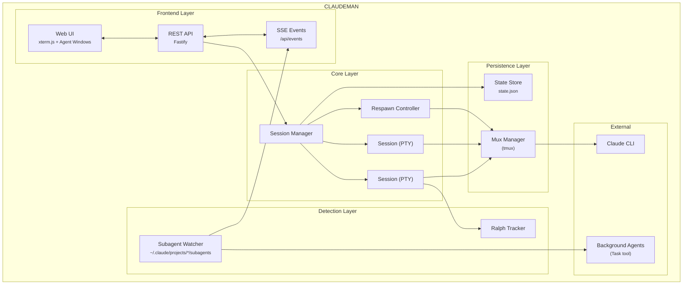

<p align="center">
  
</p>

<h2 align="center">The missing control plane for Claude Code</h2>

<p align="center">
  <em>Agent Visualization &bull; Zero-Lag Input Overlay &bull; Mobile-First UI &bull; Respawn Controller &bull; Multi-Session Dashboard </em>
</p>

<p align="center">
  <a href="https://opensource.org/licenses/MIT"></a>
  <a href="https://nodejs.org/"></a>
  <a href="https://www.typescriptlang.org/"></a>
  <a href="https://fastify.dev/"></a>
  
</p>

<p align="center">
  
</p>

---

## Quick Start - Installation

```bash
curl -fsSL https://raw.githubusercontent.com/Ark0N/claudeman/master/install.sh | bash
```

This installs Node.js, tmux, and Claude CLI if missing, clones Claudeman to `~/.claudeman/app`, builds it. After install:

```bash
claudeman web
# Open http://localhost:3000 — press Ctrl+Enter to start your first session
```

**Update to latest version:**
```bash
curl -fsSL https://raw.githubusercontent.com/Ark0N/claudeman/master/install.sh | bash -s update
```

<details>
<summary><strong>Run as a background service</strong></summary>

**Linux (systemd):**
```bash
mkdir -p ~/.config/systemd/user && printf '[Unit]\nDescription=Claudeman Web Server\nAfter=network.target\n\n[Service]\nType=simple\nExecStart=%s %s/dist/index.js web\nRestart=always\nRestartSec=10\n\n[Install]\nWantedBy=default.target\n' "$(which node)" "$HOME/.claudeman/app" > ~/.config/systemd/user/claudeman-web.service && systemctl --user daemon-reload && systemctl --user enable --now claudeman-web && loginctl enable-linger $USER
```

**macOS (launchd):**
```bash
mkdir -p ~/Library/LaunchAgents && printf '<?xml version="1.0" encoding="UTF-8"?>\n<!DOCTYPE plist PUBLIC "-//Apple//DTD PLIST 1.0//EN" "http://www.apple.com/DTDs/PropertyList-1.0.dtd">\n<plist version="1.0"><dict><key>Label</key><string>com.claudeman.web</string><key>ProgramArguments</key><array><string>%s</string><string>%s/dist/index.js</string><string>web</string></array><key>RunAtLoad</key><true/><key>KeepAlive</key><true/><key>StandardOutPath</key><string>/tmp/claudeman.log</string><key>StandardErrorPath</key><string>/tmp/claudeman.log</string></dict></plist>\n' "$(which node)" "$HOME/.claudeman/app" > ~/Library/LaunchAgents/com.claudeman.web.plist && launchctl load ~/Library/LaunchAgents/com.claudeman.web.plist
```
</details>

<details>
<summary><strong>Windows (WSL)</strong></summary>

```powershell
wsl bash -c "curl -fsSL https://raw.githubusercontent.com/Ark0N/claudeman/master/install.sh | bash"
```

Claudeman requires tmux, so Windows users need [WSL](https://learn.microsoft.com/en-us/windows/wsl/install). If you don't have WSL yet: run `wsl --install` in an admin PowerShell, reboot, open Ubuntu, then install Claude CLI inside WSL: `curl -fsSL https://claude.ai/install.sh | bash`. After installing, `http://localhost:3000` is accessible from your Windows browser.
</details>

---

## Mobile-Optimized Web UI

The most responsive Claude Code experience on any phone. Full xterm.js terminal with local echo, swipe navigation, and a touch-optimized interface designed for real remote work.

<table><tr><td>
  
</td><td>

| Terminal Apps | Claudeman Mobile |
|:--------------|:-----------------|
| 200-300ms input lag over remote | **Local echo — instant feedback** |
| Tiny text, no context | Full xterm.js terminal, responsive layout |
| No session management | Swipe between sessions, status badges |
| No notifications | Push alerts for approvals and idle |
| Manual reconnect after drops | tmux persistence — sessions survive anything |
| No agent visibility | Background agents in real-time |
| Copy-paste slash commands | One-tap `/init`, `/clear`, `/compact` buttons |

</td></tr></table>

- **Swipe navigation** — left/right on the terminal to switch sessions (80px threshold, 300ms)
- **Keyboard accessory bar** — `/init`, `/clear`, `/compact` quick-action buttons above the virtual keyboard. Destructive commands (`/clear`, `/compact`) require a double-press to confirm — first tap arms the button, second tap executes — so you never fire one by accident on a bumpy commute
- **Smart keyboard handling** — toolbar and terminal shift up when keyboard opens (uses `visualViewport` API with 100px threshold for iOS address bar drift)
- **Safe area support** — respects iPhone notch and home indicator via `env(safe-area-inset-*)`
- **44px touch targets** — all buttons meet iOS Human Interface Guidelines minimum sizes
- **Bottom sheet case picker** — slide-up modal replaces the desktop dropdown
- **Native momentum scrolling** — `-webkit-overflow-scrolling: touch` for buttery scroll

```bash
claudeman web --https
# Open on your phone: https://<your-ip>:3000
```

> `localhost` works over plain HTTP. Use `--https` when accessing from another device, or use [Tailscale](https://tailscale.com/) (recommended) — it provides a private network so you can access `http://<tailscale-ip>:3000` from your phone without TLS certificates.

---

## Live Agent Visualization

Watch Claude's background agents work in real-time. Claudeman monitors every `Task` tool invocation and displays each agent in a draggable floating window with animated Matrix-style connection lines back to the parent session.

<p align="center">
  
</p>

- **Floating terminal windows** — draggable, resizable panels for each agent with a live activity log showing every tool call, file read, and progress update as it happens
- **Connection lines** — animated green lines linking parent sessions to their child agents, updating in real-time as agents spawn and complete
- **Status & model badges** — green (active), yellow (idle), blue (completed) indicators with Haiku/Sonnet/Opus model color coding
- **Auto-behavior** — windows auto-open on spawn, auto-minimize on completion, tab badge shows "AGENT" or "AGENTS (n)" count
- **Nested agents** — supports 3-level hierarchies (lead session -> teammate agents -> sub-subagents)

---

## Zero-Lag Input Overlay

When accessing Claude Code remotely (VPN, Tailscale, SSH tunnel), every keystroke normally takes 200-300ms to round-trip. Claudeman implements a **Mosh-inspired local echo system** that makes typing feel instant regardless of latency.

A pixel-perfect DOM overlay inside xterm.js renders keystrokes at 0ms. Background forwarding silently sends every character to the PTY in 50ms debounced batches, so Tab completion, `Ctrl+R` history search, and all shell features work normally. When the server echo arrives 200-300ms later, the overlay seamlessly disappears and the real terminal text takes over — the transition is invisible.

- **Ink-proof architecture** — lives as a `<span>` at z-index 7 inside `.xterm-screen`, completely immune to Ink's constant screen redraws (two previous attempts using `terminal.write()` failed because Ink corrupts injected buffer content)
- **Font-matched rendering** — reads `fontFamily`, `fontSize`, `fontWeight`, and `letterSpacing` from xterm.js computed styles so overlay text is visually indistinguishable from real terminal output
- **Full editing** — backspace, retype, paste (multi-char), cursor tracking, multi-line wrap when input exceeds terminal width
- **Persistent across reconnects** — unsent input survives page reloads via localStorage
- **Enabled by default** — works on both desktop and mobile, during idle and busy sessions

> Extracted as a standalone library: [`xterm-zerolag-input`](https://www.npmjs.com/package/xterm-zerolag-input) — see [Published Packages](#published-packages).

---

## Respawn Controller

The core of autonomous work. When Claude goes idle, the Respawn Controller detects it, sends a continue prompt, cycles `/clear` -> `/init` for fresh context, and resumes — running **24+ hours** completely unattended.

```
WATCHING → IDLE DETECTED → SEND UPDATE → /clear → /init → CONTINUE → WATCHING
```

- **Multi-layer idle detection** — completion messages, AI-powered idle check, output silence, token stability
- **Circuit breaker** — prevents respawn thrashing when Claude is stuck (CLOSED -> HALF_OPEN -> OPEN states, tracks consecutive no-progress and repeated errors)
- **Health scoring** — 0-100 health score with component scores for cycle success, circuit breaker state, iteration progress, and stuck recovery
- **Built-in presets** — `solo-work` (3s idle, 60min), `subagent-workflow` (45s, 240min), `team-lead` (90s, 480min), `ralph-todo` (8s, 480min), `overnight-autonomous` (10s, 480min)

---

## Multi-Session Dashboard

Run **20 parallel sessions** with full visibility — real-time xterm.js terminals at 60fps, per-session token and cost tracking, tab-based navigation, and one-click management.

<p align="center">
  
</p>

### Persistent Sessions

Every session runs inside **tmux** — sessions survive server restarts, network drops, and machine sleep. Auto-recovery on startup with dual redundancy. Ghost session discovery finds orphaned tmux sessions. Claude knows it's managed and won't kill its own session.

### Smart Token Management

| Threshold | Action | Result |
|-----------|--------|--------|
| **110k tokens** | Auto `/compact` | Context summarized, work continues |
| **140k tokens** | Auto `/clear` | Fresh start with `/init` |

### Notifications

Real-time desktop alerts when sessions need attention — `permission_prompt` and `elicitation_dialog` trigger critical red tab blinks, `idle_prompt` triggers yellow blinks. Click any notification to jump directly to the affected session. Hooks auto-configured per case directory.

### Ralph / Todo Tracking

Auto-detects Ralph Loops, `<promise>` tags, TodoWrite progress (`4/9 complete`), and iteration counters (`[5/50]`) with real-time progress rings and elapsed time tracking.

<p align="center">
  
</p>

### Run Summary

Click the chart icon on any session tab to see a timeline of everything that happened — respawn cycles, token milestones, auto-compact triggers, idle/working transitions, hook events, errors, and more.

### Zero-Flicker Terminal

Claude Code uses Ink (React for terminals) which redraws the entire screen on every state change. Claudeman implements a 6-layer anti-flicker pipeline for smooth 60fps output across all sessions:

```
PTY Output → 16ms Server Batch → DEC 2026 Wrap → SSE → Client rAF → xterm.js (60fps)
```

---

## SSH Alternative (`sc`)

If you prefer SSH (Termius, Blink, etc.), the `sc` command is a thumb-friendly session chooser:

```bash
sc              # Interactive chooser
sc 2            # Quick attach to session 2
sc -l           # List sessions
```

Single-digit selection (1-9), color-coded status, token counts, auto-refresh. Detach with `Ctrl+A D`.

---

## Keyboard Shortcuts

| Shortcut | Action |
|----------|--------|
| `Ctrl+Enter` | Quick-start session |
| `Ctrl+W` | Close session |
| `Ctrl+Tab` | Next session |
| `Ctrl+K` | Kill all sessions |
| `Ctrl+L` | Clear terminal |
| `Ctrl+Shift+R` | Restore terminal size |
| `Ctrl/Cmd +/-` | Font size |
| `Escape` | Close panels |

---

## API

### Sessions
| Method | Endpoint | Description |
|--------|----------|-------------|
| `GET` | `/api/sessions` | List all |
| `POST` | `/api/quick-start` | Create case + start session |
| `DELETE` | `/api/sessions/:id` | Delete session |
| `POST` | `/api/sessions/:id/input` | Send input |

### Respawn
| Method | Endpoint | Description |
|--------|----------|-------------|
| `POST` | `/api/sessions/:id/respawn/enable` | Enable with config + timer |
| `POST` | `/api/sessions/:id/respawn/stop` | Stop controller |
| `PUT` | `/api/sessions/:id/respawn/config` | Update config |

### Ralph / Todo
| Method | Endpoint | Description |
|--------|----------|-------------|
| `GET` | `/api/sessions/:id/ralph-state` | Get loop state + todos |
| `POST` | `/api/sessions/:id/ralph-config` | Configure tracking |

### Subagents
| Method | Endpoint | Description |
|--------|----------|-------------|
| `GET` | `/api/subagents` | List all background agents |
| `GET` | `/api/subagents/:id` | Agent info and status |
| `GET` | `/api/subagents/:id/transcript` | Full activity transcript |
| `DELETE` | `/api/subagents/:id` | Kill agent process |

### System
| Method | Endpoint | Description |
|--------|----------|-------------|
| `GET` | `/api/events` | SSE stream |
| `GET` | `/api/status` | Full app state |
| `POST` | `/api/hook-event` | Hook callbacks |
| `GET` | `/api/sessions/:id/run-summary` | Timeline + stats |

---

## Architecture



---

## Development

```bash
npm install
npx tsx src/index.ts web    # Dev mode
npm run build               # Production build
npm test                    # Run tests
```

See [CLAUDE.md](./CLAUDE.md) for full documentation.

---

## Published Packages

### [`xterm-zerolag-input`](https://www.npmjs.com/package/xterm-zerolag-input)

[](https://www.npmjs.com/package/xterm-zerolag-input)

Instant keystroke feedback overlay for xterm.js. Eliminates perceived input latency over high-RTT connections by rendering typed characters immediately as a pixel-perfect DOM overlay. Zero dependencies, configurable prompt detection, full state machine with 78 tests.

```bash
npm install xterm-zerolag-input
```

[Full documentation](packages/xterm-zerolag-input/README.md)

---

## License

MIT — see [LICENSE](LICENSE)

---

<p align="center">
  <strong>Track sessions. Visualize agents. Control respawn. Let it run while you sleep.</strong>
</p>
